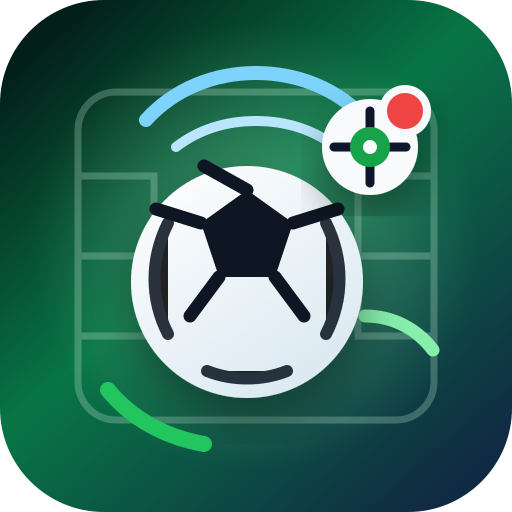

<p align="center">
  
</p>

# GoalScout Agent

Live football goal alerts, match memory, and channel delivery for OpenClaw, Hermes, and portable agent platforms.

GoalScout Agent watches live football data, remembers your favorite teams and players, and sends goal or match-event notifications to the channel you configure. The default provider is SportScore, which does not require an API key.

## Features

- Favorite country, teams, players, competitions, and alert types.
- Live goal and key-event notifications.
- OpenClaw, Hermes, webhook, custom command, and console delivery.
- Persistent memory for the last match, last alert, and recent football context.
- No-key SportScore provider by default.
- Optional API-Football provider for users with a paid or free provider key.
- Background watcher for always-on notifications.
- Professional Codex/OpenClaw/Hermes skill metadata and icons.

## Quick Start

```powershell
cd "E:\Football agent or skill"
python -m pip install -e ".[dev]"
goalscout-agent onboard
goalscout-agent once
```

Start continuous watching:

```powershell
goalscout-agent start-background
goalscout-agent status
```

Stop it:

```powershell
goalscout-agent stop
```

## Delivery

Console delivery is enabled by default. For OpenClaw:

```powershell
$env:FOOTBALL_AGENT_DELIVERY = "openclaw"
$env:FOOTBALL_AGENT_CHANNEL = "telegram"
$env:FOOTBALL_AGENT_TARGET = "@your-chat-or-group"
goalscout-agent test-notification
```

For Hermes:

```powershell
$env:FOOTBALL_AGENT_DELIVERY = "hermes"
$env:FOOTBALL_AGENT_CHANNEL = "telegram"
$env:FOOTBALL_AGENT_TARGET = "@your-chat-or-group"
goalscout-agent test-notification
```

For a custom platform command:

```powershell
$env:FOOTBALL_AGENT_CHANNEL_COMMAND = "openclaw message send --channel {channel} --target {target} --message {message}"
```

## Commands

```powershell
goalscout-agent onboard
goalscout-agent preferences
goalscout-agent memory
goalscout-agent health-check
goalscout-agent test-notification
goalscout-agent once
goalscout-agent watch
goalscout-agent start-background
goalscout-agent status
goalscout-agent stop
```

## Skill and Plugin Packaging

This repository includes:

- `.codex-plugin/plugin.json` for plugin marketplace presentation.
- `skills/goalscout-agent/SKILL.md` for agent behavior.
- `skills/goalscout-agent/agents/openai.yaml` for UI metadata.
- `assets/` and `skills/goalscout-agent/assets/` for icons.

The plugin metadata points to the `AKADevelopers/GoalScout-Agent` GitHub repository.

## Data and Privacy

Runtime data is stored locally in `.football-live-agent/`. Do not commit that folder. API keys should be provided through environment variables, not written into skill files or prompts.

SportScore availability and latency depend on the public SportScore endpoint. The watcher polls and sends alerts when the provider returns live incidents.

## Development

Run the full verification set:

```powershell
python -m pytest -q
python "C:\Users\Abid khan afridi\.codex\skills\.system\skill-creator\scripts\quick_validate.py" "E:\Football agent or skill\skills\goalscout-agent"
python "C:\Users\Abid khan afridi\.codex\skills\.system\plugin-creator\scripts\validate_plugin.py" "E:\Football agent or skill"
```

## License

MIT License. See `LICENSE`.
